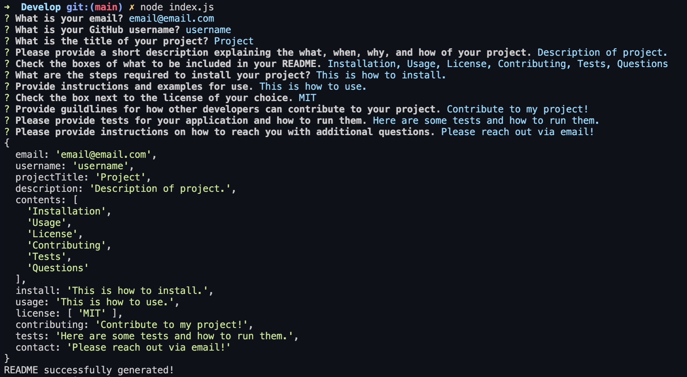
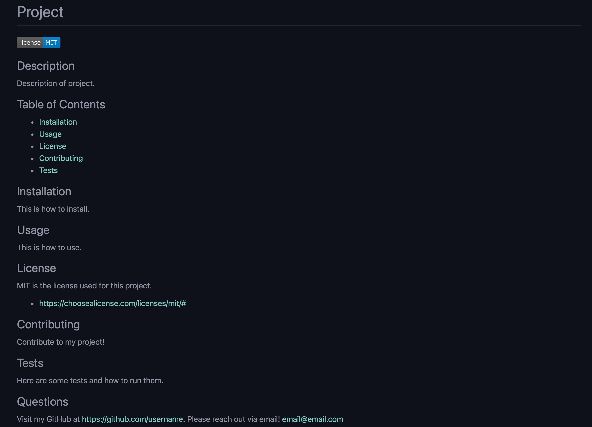

# README Generator

## Description
A command-line application that allows for a user to dynamically generate a professional, high-quality README. This application makes writing a README quick, easy, and painless!

## Table of Contents

- [Usage](#usage)
- [Visual](#visual) 
- [Credits](#credits)
- [Links](#links)

## Usage
Simply answer questions, as detailed as you'd like, to generate a professional, high-quality README for your next open-source project. 

## Visual

## Credits

- Images for License Badge
    - https://img.shields.io/badge/License

## Links

- GitHub Repository
    - https://github.com/giovannaruggio/readME-generator

